# **ガマン銀行 画面仕様書**
画面リスト
+ ログイン画面
+ ログイン失敗画面
+ 新規登録画面
+ 新規登録失敗画面
+ 新規登録成功画面
+ ID・パスワードを忘れた場合画面←他の画面・機能が完成してから
+ ホーム＆入金画面
+ 入出金後画面
+ 出金画面
+ 通帳画面
+ データ画面
+ 設定画面←他の画面・機能が完成してから
+ ログアウト後画面

## **ログイン画面**

1.ヘッダーロゴ(ログイン画面用)
+ リンク無し画像

2.タイトル
+ 「ようこそ」の文字列を表示

3.ID(ユーザー名)入力欄
+ 登録済みのIDを入力

4.パスワード入力欄
+ 登録済みのパスワードを入力

5.ログインボタン
+ ボタンが押された際に、IDとパスワードが入力済みだった場合ホーム画面に遷移
+ ボタンが押された際に、IDとパスワードのどちらかが未登録だった場合は、
再度ログイン画面(警告)に遷移してアラートを表示

6.新規登録ボタン
+ ボタンが押されたら新規登録画面に遷移

7.ロゴ画像
+ 画像を表示

## **ログイン失敗画面**

1.警告
+ 赤文字で警告を表示する。

## **新規登録画面**

1.ID(ユーザー名)入力欄
+ プレースホルダーで条件を表示
+ 以下の条件に一致しない場合は「登録する」ボタン押下後の遷移画面で対応するテキスト(赤文字)を表示
    + 既存のIDとの重複禁止
        + ※このIDは既に使用されています。
    + 10文字以内 ：
        + ※IDは10文字以内

2.パスワード入力欄
+ プレースホルダーで条件を表示
+ + 入力内容は●で表示
+ 以下の条件に一致しない場合は「登録する」ボタン押下後の遷移画面で対応するテキスト(赤文字)を表示
    + 半角英数のみ
        ※パスワードは5文字以上10文字以内の半角英数のみ
    + 5文字以上かつ10文字以内
        ※パスワードは5文字以上10文字以内の半角英数のみ

3.パスワード確認用欄
+ プレースホルダーで条件を表示
+ 入力内容は●で表示
+ 以下の条件に一致しない場合は「登録する」ボタン押下後の遷移画面で対応するテキスト(赤文字)を表示
    + 2.と同一の内容
        + ※同じパスワードを入力してください。

4.メールアドレス入力欄
+ プレースホルダーで条件を表示
+ メールアドレスが存在しない場合は、「登録する」ボタン押下後の遷移画面で対応するテキスト(赤文字)を表示
    + ※指定のメールアドレスが存在しません。

5.登録ボタン
+ 入力内容のエラーの有無で遷移先を分岐
    + エラー無し：新規登録成功画面へ遷移
    + エラー有り：新規登録失敗画面へ遷移

6.キャセルボタン
+ ログイン画面へ遷移

## **新規登録失敗画面**

1.各種入力欄
+ 前画面での入力内容を保持

2.エラー内容表示
+ エラーが発生した項目のみエラー内容を表示

## **新規登録成功画面**

1.ログイン画面へ戻るボタン
+ ログイン画面へ遷移

## **ホーム画面**

1.ヘッダーロゴ
+ ホーム画面へのリンク有り画像

2.ID(ユーザー名)＆テキスト
+ ID(ユーザー名)を呼び出して"さんの残高は..."と結合して表示

3.残高表示
+ ユーザーの残高を呼び出して表示

4.残高連動コメント
+ 残高金額に連動した文字列を呼び出して表示

5.入金額入力欄
+ ユーザーが入金した金額を手入力
+ プレースホルダーで次のテキストを表示"入金額を入力してください。"

6.テキスト"・ガマンしたお買い物"

7.カテゴリ選択
+ ラジオボタン
+ 項目は"飲み物","お菓子","外食","ファッション","その他"で固定
+ 将来的には大カテゴリ→中カテゴリ→小カテゴリとリストで選択する方式に変更を想定

8.テキストエリア
+ 制限文字数20文字
+ カテゴリ選択に該当する項目が無かった場合のメモ欄、該当項目があった場合でも詳細なカテゴリーや品目・品名の入力を想定(例)飲み物→コーラ、コーヒー.etc

9.入金ボタン
+ 入金後画面へ遷移

10.メニューボタン[出金],[ホーム]
+ 出金メニューへ遷移
+ ホーム画面以外では、"ホーム"と表記してホーム画面へ遷移

11.メニューボタン[通帳]
+ 通帳メニューへ遷移

12.メニューボタン[データ]
+ データメニューへ遷移

13.メニューボタン[設定]
+ 設定メニューへ遷移

14.ログアウトボタン
+ ログアウト後画面へ遷移

## **入出金後画面**

1.入出金額
+ ホーム画面もしくは出金画面で入力された入出金額を表示(出金の場合はマイナス表記)

2.入金/出金額を入力してください。
+ 遷移元の画面に合わせて、テキストを変更"入金が完了しました!","出金が完了しました!"

3.ホーム画面へ戻るボタン
+ ホーム画面へ遷移

## **出金画面**

1.出金額を入力してください。
+ ホーム画面からテキストを変更

2.・なにを買いましたか？
+ ホーム画面からテキストを変更

3.出金するボタン
+ 入出金後画面へ遷移

## **通帳画面**

1.{ユーザー名}さんの通帳
+ ユーザー名を取得してテキストを表示

2.通帳
+ データベースから入出金の履歴を取引別に取得して表示
+ 将来的には修正・削除の機能も追加したい

## **データ画面**

1.他のユーザーとの比較
+ 項目の内容に沿ってデータベースから抽出した値を表示

2.ランキング
+ 項目の内容に沿ってデータベースから抽出した値を表示

## **ログアウト後画面**

1.ログイン画面へ戻るボタン
+ ログイン画面へ遷移